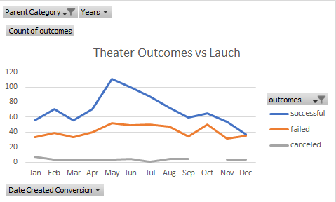
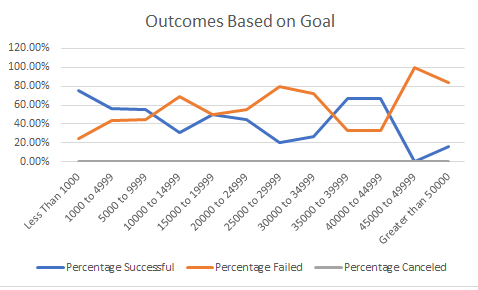

# kickstarter-analysis-
## Overview of our Project

### Louise has a goal to launch her own play, but needs some help figuring out when is the best time to do so. When we are looking at this data, we are looking to see what information we can provide to Louise in regard to her play *Fever*. Louise is looking to the data to know what past people have done that the outcome resulted in a fully funded play. When looking at this data, we will be able to provide Louise with a reccomendation that will give her a higher chance of succeeding in her goals.

## Analysis and Challenges

### Theater Outcomes by Launch Date
When looking at the launch date and how successful a project is, you can see a trend thoughout the data. Based on the data provided, you can see that buring the months between May and August, there is a higher chance of your project succeeding. May is the best month to launch your project, based on the data, but also has the highest rate of failure. Knowing this information can deter a person from launching in May. There is just one thing to keepin in mind, there is a 8.11% chance of your project succeeding in the month of May, and only a 3.8% chance of failure.

### Theater Outcomes based on Goals
Another thing to keep in mind when trying to make sure that the project will have the best chance of being funded is looking at the outcomes baed on goals. Goals are an important part of the process. If what you need has too high of a goal,  you have a higher chance of failure. when looking at the data below, you have the highest chance of success under two goals. First, if you goal is less than $1000, there was about a 76% chance of success. Secondly, if your goal was between $35,000 and $44,999, there is about a 67% chance of success. Using this data will help you determine about how much you will need to have a successful outcome.

### Challenges and Difficulties Encountered
When looking at this data, there are a few things that could possibly become a challenge for you. First, you could become overwhelmed by the data. The information on the Kickstarter tab has a lot of data you will have to sift through to find what you actually need. This is when you need to take a step back and filter out any data that you do not need. This could also cause another issue unfortunately, you may filter out data that you actually need, and once you no longer have the data, you will not come to the correct solution.

## Results

- After looking through the data and the tables I made, i can see two very distinct outcomes. The first is that if you want the best possible chance of success, Louise will want to launce around May. Looking at the data there is a 8.11% chance of success compaired to the next highest of 7.3% in June. Secondly, thre is about the same chance of your project failing and succeeding duruing the month of December. This may be due to a multitue of reason, such as people want to help others during the holiday season, but also want to spend their money on their friends and family. 

- Next, looking at the outocmes that are based on goals, you will want to have either a goal that is under $1000 or between $35,000 and $44,999. There is about a 66% to 76% chance of succeeding. 

- When looking at the data set, you may see some limitations. One would be that the data is only collected for about 9 years. This could possibly be a limitation due to not enough data can be collected during that amount of time. Another possible limitation is that we may have too much data, and it may no longer be relevent. We may ask how relevent data from 2009 is to now.

- Some other tables we could look at is comparing the parent categories for the data. We could see how well plays do compared to other types of kickstarters. We could use a pie chart to see the percent of successful kickstarters all together compared to failures. 
